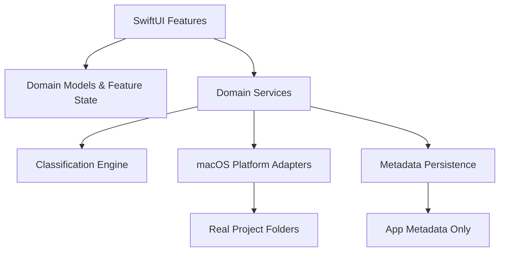
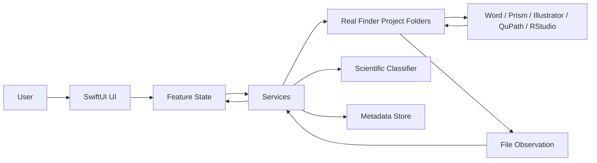
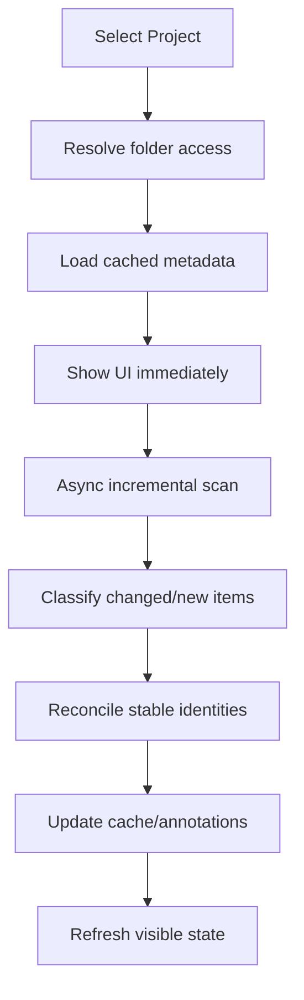
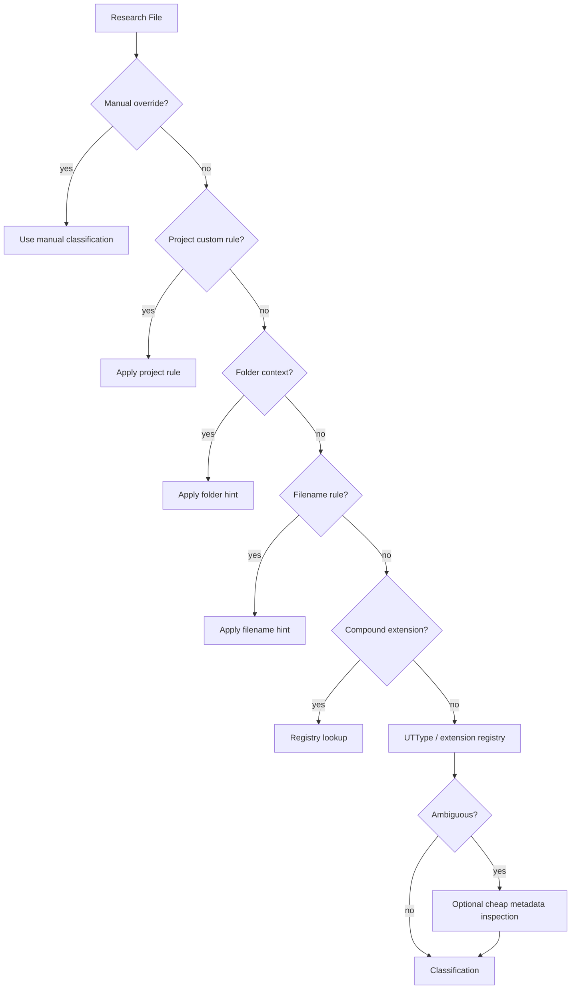

# Research Workspace — macOS 27 Native Architecture & UI Specification

> **Status:** Canonical architecture / source of truth  
> **Target:** macOS 27, Apple silicon, Xcode 27, Swift 6.x  
> **Product type:** Native macOS research project file workspace  
> **Primary user:** Single-user scientific research workflow  
> **Storage model:** External Finder folders are the real files; the app indexes and operates on them  
> **UI direction:** Minimal, native, high-information-density macOS 27 interface  
> **Last architectural reset:** Abandons app-internal managed-library storage

---

# 0. Executive decision

Research Workspace is **not** an app-private file vault and **not** a database that owns imported scientific files.

It is a native macOS workspace that manages **multiple real project folders on disk**.

The fundamental rule is:

> **Finder owns the files; Research Workspace owns the research context.**

A project is a real directory selected by the user, for example:

```text
~/Research/Leydig-Aging/
~/Research/Fenvalerate/
~/Research/Male-Contraception/
```

Word, Excel, GraphPad Prism, Adobe Illustrator, QuPath, Fiji, RStudio, VS Code, Python, MATLAB, FlowJo and other applications always open the **same real files at their original paths**.

Therefore:

- A `.docx` opened from Research Workspace can be edited and saved by Microsoft Word in place.
- A `.pzfx` opened from Research Workspace can be edited by GraphPad Prism in place.
- A `.ai` file can be edited by Illustrator in place.
- A `.qpproj` or image can be opened by QuPath/Fiji without an export-import round trip.
- The user can still inspect every file normally in Finder.
- Removing the app does not trap or destroy research data.

The app provides:

- Multi-project navigation
- Scientific file classification
- Finder-grade file operations
- Search and filtering
- Quick Look
- Metadata, favorites, notes and tags
- Research-stage context
- Fast recent-file workflows
- Native macOS commands and keyboard shortcuts

The app does **not** become the exclusive editor for scientific file formats.

---

# 1. Product goals

## 1.1 Primary goal

Turn heterogeneous scientific folders into a coherent research workspace without breaking compatibility with the macOS file ecosystem.

The app must make a chaotic project understandable at a glance:

- What are the raw data?
- What are the processed data?
- Which files are statistical analyses?
- Which files are figures?
- Which files are source figures?
- Which files are manuscripts?
- Which files are literature?
- Which files belong to submission/revision?
- Which files changed recently?
- Which files are most important?
- Which project is in which research stage?

## 1.2 Non-goal

Do not become:

- a Zotero clone
- a PDF editor
- an Office editor
- a Prism clone
- a cloud drive
- a hidden file vault
- a database-backed replacement filesystem
- an Electron web dashboard
- an all-in-one LIMS
- a notebook environment
- a Git client

---

# 2. macOS 27 platform baseline

## 2.1 Deployment target

Use:

```text
macOS 27+
Apple silicon only
Xcode 27+
Swift 6.x
SwiftUI-first
```

Do not support Intel or Rosetta.

Do not carry compatibility shims for old macOS releases unless a concrete need emerges later.

## 2.2 Framework priority

Use Apple frameworks before third-party packages:

```text
SwiftUI
Observation
AppKit
Foundation
UniformTypeIdentifiers
QuickLook
QuickLookThumbnailing
CoreTransferable
SwiftData
OSLog
```

Use AppKit where macOS-specific behavior is superior or unavailable in SwiftUI, including:

```text
NSOpenPanel
NSSavePanel
NSWorkspace
QLPreviewPanel
NSMenu / command bridging when required
NSFileCoordinator / NSFilePresenter where coordination is justified
```

## 2.3 Architecture style

Do not force classic MVVM onto every screen.

Use:

> **SwiftUI + Observation + feature-oriented state + domain services**

Views should be declarative and thin.

Business logic must not live in Views.

Avoid:

- giant `ObservableObject`
- giant `AppState`
- service locator
- Redux-style global reducers
- dependency injection frameworks
- needless protocol abstraction
- protocol-per-type architecture
- Clean Architecture layer inflation

---

# 3. Storage model — External Workspace Mode

## 3.1 Project files remain outside the app

A Research Project is defined by:

```swift
ResearchProject {
    id
    displayName
    rootFolder
    accessBookmark
    status
    targetJournal
    description
    tags
}
```

The root folder is a real user folder.

Example:

```text
/Users/user/Research/Leydig-Aging/
```

Research Workspace does not mirror this directory into its own container.

## 3.2 App-owned metadata

Only app metadata belongs in Application Support.

Recommended location:

```text
~/Library/Application Support/ResearchWorkspace/
```

Persist:

- registered projects
- folder access bookmark
- project display name
- project status
- target journal
- project notes
- favorites
- app tags
- per-file manual classification overrides
- UI preferences
- cached file metadata
- saved searches
- custom classification rules

Never persist copies of research files there unless explicitly implementing a temporary cache.

## 3.3 App Sandbox clarification

**Do not confuse App Sandbox with app-internal data storage.**

Recommended shipping architecture:

```text
App Sandbox: ON
User Selected Files: Read/Write
Project data: external Finder folders
Persistent access: security-scoped folder bookmarks
```

This retains macOS security while allowing full read/write operations inside project roots selected by the user.

The actual `.docx`, `.xlsx`, `.pzfx`, `.ai`, `.tif`, etc. remain normal files outside the app container.

If this app is permanently personal/direct-distribution software and a future requirement genuinely needs unrestricted filesystem access, an unsandboxed Direct Distribution build can be evaluated separately. It is **not required** for the core architecture.

---

# 4. Multi-project architecture

The app must support an arbitrary practical number of projects.

Example sidebar:

```text
Projects
  Leydig Cell Aging
  Male Contraception Review
  Fenvalerate
  HMGCS2 Follow-up
```

The app must support:

- Add Project
- Remove Project from Workspace
- Rename project display name
- Change project metadata
- Re-link missing project root
- Archive project in app metadata
- Open project in Finder
- Open project in a new window
- Multiple project windows if useful

Removing a project from Research Workspace **must never delete its real folder**.

## 4.1 Project switching

Switching project changes:

- file index
- category filters
- recent list
- project dashboard
- inspector context
- saved searches

It must not require reopening the app.

## 4.2 Window model

Default:

- One main workspace window
- Project selection in sidebar

Optional native behavior:

- `File > Open Project in New Window`
- separate window state per project

Do not force tabbed documents for V1.

---

# 5. Filesystem access

## 5.1 Add Project flow

```text
Add Project
    ↓
NSOpenPanel / fileImporter
    ↓
user selects real project folder
    ↓
validate readable + writable state
    ↓
create persistent folder bookmark
    ↓
register project metadata
    ↓
initial metadata scan
    ↓
show project
```

Project selection should use a system file panel, never a custom fake Finder picker.

## 5.2 Persistent folder access

For a sandboxed build:

- store security-scoped bookmark data
- resolve the bookmark on app launch/project activation
- detect stale bookmarks
- refresh stale bookmarks
- call `startAccessingSecurityScopedResource()` only for the needed lifetime
- balance with `stopAccessingSecurityScopedResource()`

Create bookmarks for the **project root**, not every child file.

Access to selected folder content should be inherited recursively where allowed.

## 5.3 Word/Prism/Illustrator compatibility

External editors operate on original URLs.

Opening:

```text
Research Workspace
     ↓
NSWorkspace
     ↓
Microsoft Word / Prism / Illustrator / QuPath / etc.
     ↓
same file URL on disk
```

There is no import/export boundary for ordinary editing.

Research Workspace must expect files to change while it is running.

---

# 6. Finder-grade file operations

The app should provide a focused subset of Finder functionality inside registered project roots.

## 6.1 Required operations

V1:

- New Folder
- Rename
- Duplicate
- Copy
- Cut
- Paste
- Move
- Import Files
- Import Folder
- Export / Copy Out
- Move to Trash
- Reveal in Finder
- Open
- Open With
- Quick Look
- Copy Path
- Copy Relative Path
- Select All
- Multi-selection
- Drag and drop

Later:

- batch rename
- aliases
- Finder tags integration
- compression
- share services

## 6.2 Operation architecture

No SwiftUI View may directly perform filesystem mutation.

All mutations go through:

```text
FileOperationService
```

Suggested API surface:

```swift
actor FileOperationService {
    func createFolder(...)
    func rename(...)
    func duplicate(...)
    func copy(...)
    func move(...)
    func trash(...)
    func importItems(...)
    func exportItems(...)
}
```

The service handles:

- validation
- destination conflicts
- permissions
- file coordination where needed
- error translation
- index invalidation
- undo registration when practical
- selection update
- operation progress

## 6.3 Finder-native operations where useful

Prefer system-equivalent behavior for user expectations.

Examples:

- `NSWorkspace.duplicate(_:completionHandler:)`
- `NSWorkspace.recycle(_:completionHandler:)`
- `NSWorkspace.activateFileViewerSelecting(_:)`
- modern `NSWorkspace.open` APIs

For ordinary copying and moving within project roots, Foundation `FileManager` is appropriate.

Avoid deprecated `openFile` APIs.

## 6.4 Rename

Inline rename should feel Finder-like.

Behavior:

- `Return` begins rename for selected item
- preserve extension selection behavior
- initial selection normally excludes filename extension
- validate forbidden path separators
- detect collision
- support Escape to cancel
- commit with Return/click away
- preserve metadata association after rename

## 6.5 Copy / Cut / Paste

Shortcuts:

```text
⌘C      Copy
⌘X      Cut
⌘V      Paste
```

Optional Finder-compatible move-paste:

```text
⌥⌘V
```

Internal clipboard model should contain file URLs + operation intent.

Do not store file bytes in memory for large scientific files.

## 6.6 Delete

Use:

> **Move to Trash**

Never expose a destructive permanent-delete button as a primary operation.

Use Finder-equivalent recycle behavior where possible.

Require confirmation only when platform convention or irreversible behavior warrants it; avoid alert fatigue.

---

# 7. External modification and coordination

Files will be edited by other apps.

Research Workspace must treat external modification as normal, not exceptional.

## 7.1 Required cases

Handle:

- Word saves a DOCX
- Prism rewrites a PZFX
- Illustrator saves an AI
- R script creates CSV outputs
- QuPath creates project files
- Finder renames a folder
- Finder moves a file
- external sync software updates a file
- user deletes a file outside Research Workspace

## 7.2 Refresh strategy

Use a layered strategy:

### V1

- initial project scan
- refresh on project activation
- refresh when application becomes active
- explicit Refresh command
- lightweight directory monitoring

### Mature version

Use filesystem change observation to invalidate affected paths rather than rescan everything.

Consider:

- FSEvents for directory tree changes
- `NSFilePresenter` where presenting/coordinating a project directory is appropriate
- `NSFileCoordinator` for coordinated mutations that can race with other processes

Do not add an `NSFilePresenter` per file for tens of thousands of files.

Prefer project-root/directory-level change observation.

---

# 8. Stable file identity

Path alone is not a perfect identity because users rename and move files.

The metadata association strategy should be:

1. filesystem resource identifier when available
2. volume identity + resource identifier
3. relative path fallback
4. bounded reconciliation heuristics after scan

Do not hash every file by default.

For multi-GB TIFF/BAM/FASTQ/WSI files, full hashing is unacceptable for ordinary indexing.

Suggested runtime identity:

```swift
struct FileIdentity: Hashable, Sendable {
    let resourceIdentifier: Data?
    let volumeIdentifier: String?
    let relativePath: String
}
```

Persist manual metadata against a stable internal record that can update its path when the resource is detected at a new location.

---

# 9. Indexing architecture

## 9.1 Principle

Index metadata, not file contents.

Default scanner reads:

- filename
- relative path
- URL resource values
- size
- creation date
- modification date
- content type / UTType where available
- package/bundle state
- directory state
- file resource identifier
- hidden flag
- symbolic-link state

Do not parse:

- TIFF pixels
- WSI pyramids
- BAM bodies
- FASTQ contents
- PDF full text
- DOCX XML
- HDF5 content

during ordinary indexing.

## 9.2 Scanner

```text
ProjectScanService
```

Responsibilities:

- recursive metadata enumeration
- cancellation
- progress
- ignore rules
- package detection
- batch emission
- incremental reconciliation
- index update

Scanner must not run on the MainActor.

Use Swift concurrency.

## 9.3 Performance goals

For normal project sizes (hundreds to tens of thousands of entries):

- window opens immediately
- cached index displays immediately
- refresh occurs asynchronously
- UI remains responsive
- scan progress is subtle, not modal

Do not block UI while scanning.

## 9.4 Large files

For large files:

- no content parsing
- no default hash
- no forced thumbnail if Quick Look generation is expensive
- metadata only

---

# 10. Scientific classification model

Do **not** reduce every file to one simplistic category.

Use four orthogonal semantic dimensions:

```text
Workflow Category
Scientific Domain
File Format
Research Role
```

Example:

```text
HMGCS2_24M_final.tif

Workflow Category: Figures
Scientific Domain: Digital Pathology
File Format: TIFF
Research Role: Processed Figure
```

Another:

```text
GSE182786_counts.h5ad

Workflow Category: Processed Data
Scientific Domain: Single-cell Transcriptomics
File Format: AnnData H5AD
Research Role: Analysis Dataset
```

## 10.1 Workflow categories

Recommended visible sidebar categories:

- Literature
- Manuscript
- Raw Data
- Processed Data
- Statistics
- Figures
- Analysis
- Protocols
- Submission
- Other

Scientific domains should usually be filters/tags rather than more permanent top-level sidebar sections.

## 10.2 Scientific domains

Examples:

- Microscopy
- Digital Pathology
- Flow Cytometry
- Genomics
- Transcriptomics
- Single-cell
- Proteomics
- Metabolomics
- Molecular Biology
- Histology
- Statistics
- Bioinformatics
- General

## 10.3 Research roles

Examples:

- Raw
- Intermediate
- Processed
- Source Figure
- Final Figure
- Supplementary Figure
- Statistical Output
- Script
- Notebook
- Manuscript Draft
- Submission File
- Protocol
- Reference
- Annotation
- Configuration
- Archive

---

# 11. Classification precedence

Use a deterministic pipeline:

```text
Manual Override
      ↓
Project Custom Rule
      ↓
Path / Folder Context
      ↓
Filename Rule
      ↓
Compound Extension Rule
      ↓
UTType
      ↓
Extension Registry
      ↓
Cheap Signature / Metadata Inspection (only where justified)
      ↓
Other
```

Manual override always wins.

Automatic refresh must never silently overwrite a user override.

Persist classification source:

```swift
enum ClassificationSource {
    case manual
    case projectRule
    case folderRule
    case filenameRule
    case compoundExtension
    case utType
    case extensionRegistry
    case lightweightInspection
    case fallback
}
```

The Inspector should be able to show a short explanation:

```text
Figures
Matched folder rule: /Figures/
```

---

# 12. File type registry

All file format knowledge must live in a centralized registry.

Never scatter checks like:

```swift
if url.pathExtension == "tif"
```

through Views.

Suggested model:

```swift
struct FileTypeDescriptor: Sendable {
    let canonicalIdentifier: String
    let extensions: Set<String>
    let compoundExtensions: Set<String>
    let displayName: String
    let domainHints: Set<ScientificDomain>
    let workflowHints: Set<WorkflowCategory>
    let sourceApplicationHints: [ApplicationHint]
    let ambiguity: AmbiguityLevel
}
```

The registry must support:

- exact filename rules
- normal extensions
- compound extensions
- ambiguous extensions
- multiple possible semantic categories
- source application hints
- future custom rules

---

# 13. Scientific file taxonomy

This registry should be broad from the beginning because the user works across multiple scientific applications.

## 13.1 Documents / manuscript / literature

```text
.pdf
.doc
.docx
.pages
.rtf
.rtfd
.txt
.md
.markdown
.tex
.bib
.ris
.enw
.nbib
.epub
.html
.htm
.xml
```

Special meanings:

```text
.bib / .ris / .enw / .nbib → citation metadata
.tex → manuscript/source
.pdf → ambiguous; context required
```

## 13.2 Office / tabular / structured data

```text
.xls
.xlsx
.xlsm
.xlsb
.csv
.tsv
.ods
.numbers
.json
.jsonl
.yaml
.yml
.xml
.parquet
.feather
.arrow
.h5
.hdf5
.mat
```

## 13.3 GraphPad Prism

```text
.pzfx
.prism
```

Preferred subtype:

```text
GraphPad Prism Project
```

Workflow hint:

```text
Statistics
```

## 13.4 Vector / figure design

```text
.ai
.eps
.svg
.svgz
.ps
.pdf
.fig
.sketch
.afdesign
.afphoto
```

Source application hints:

```text
Adobe Illustrator
Affinity Designer
Affinity Photo
Sketch
MATLAB (for .fig depending on context)
```

## 13.5 Raster images

```text
.tif
.tiff
.png
.jpg
.jpeg
.heic
.webp
.bmp
.gif
.jp2
.j2k
```

Compound/special:

```text
.ome.tif
.ome.tiff
```

## 13.6 Microscopy

```text
.czi       Zeiss
.lif       Leica
.lsm       Zeiss
.nd2       Nikon
.oib       Olympus/Evident
.oif       Olympus/Evident
.vsi       Olympus/Evident
.oir       Olympus/Evident
.dv
.mrc
.stk
.ims       Imaris
.ome.tif
.ome.tiff
```

Recognition does not imply rendering support.

## 13.7 Digital pathology / WSI

```text
.svs
.ndpi
.mrxs
.scn
.bif
.vms
.vmu
.qptiff
```

QuPath-related:

```text
.qpproj
.geojson
```

Subtypes:

- Whole Slide Image
- QuPath Project
- Annotation

## 13.8 Medical imaging

```text
.dcm
.dicom
.nii
.nii.gz
.mha
.mhd
.nrrd
```

Domains:

- DICOM
- NIfTI
- Medical Imaging

## 13.9 Flow cytometry

```text
.fcs
.wsp
```

Subtypes:

- FCS Data
- FlowJo Workspace

## 13.10 Sequence / molecular biology

```text
.fasta
.fa
.fna
.faa
.seq
.gb
.gbk
.genbank
.ab1
.scf
.dna
```

Hints:

- FASTA
- GenBank
- Sanger
- SnapGene
- Plasmid / Sequence

## 13.11 Sequencing reads

```text
.fastq
.fq
.fastq.gz
.fq.gz
```

## 13.12 Alignment

```text
.sam
.bam
.cram
.bai
.crai
```

## 13.13 Variants

```text
.vcf
.vcf.gz
.bcf
```

## 13.14 Genome annotation / tracks

```text
.gtf
.gff
.gff3
.bed
.bedgraph
.bigwig
.bw
.bigbed
```

## 13.15 Expression / single-cell / R data

```text
.mtx
.h5
.h5ad
.loom
.rds
.rda
.RData
```

Hints:

- Seurat
- Scanpy
- AnnData
- 10x matrix
- R serialized object

## 13.16 R

```text
.R
.r
.Rmd
.qmd
.Rproj
.rds
.rda
.RData
```

Special filenames:

```text
renv.lock
.Rprofile
```

`.Rhistory` is normally noise/history and should be hidden by default.

## 13.17 Python / notebooks

```text
.py
.pyx
.ipynb
```

Special:

```text
requirements.txt
pyproject.toml
Pipfile
poetry.lock
environment.yml
```

Ignore:

```text
__pycache__/
.pytest_cache/
.venv/
.ipynb_checkpoints/
```

unless user explicitly enables them.

## 13.18 Shell / scripting / reproducibility

```text
.sh
.bash
.zsh
.pl
.pm
.jl
.lua
.sql
```

Special:

```text
Dockerfile
docker-compose.yml
Makefile
CMakeLists.txt
```

## 13.19 MATLAB / Mathematica

```text
.m
.mat
.mlx
.nb
.wl
```

`.m` is ambiguous between MATLAB and Objective-C; classify by folder/project context and content only if cheap.

## 13.20 Statistics packages

SPSS:

```text
.sav
.zsav
.por
.spv
```

Stata:

```text
.dta
.do
.ado
.smcl
```

SAS:

```text
.sas
.sas7bdat
```

JMP:

```text
.jmp
```

## 13.21 Proteomics / mass spectrometry

```text
.raw
.mzML
.mzXML
.mgf
.pepXML
.mzIdentML
```

`.raw` is highly ambiguous and must not be classified solely by extension.

## 13.22 Archives

```text
.zip
.tar
.tar.gz
.tgz
.gz
.bz2
.xz
.7z
.rar
```

No automatic decompression.

## 13.23 Git / development

```text
.gitignore
.gitattributes
.gitmodules
README
README.md
LICENSE
.swift
.xcodeproj
.xcworkspace
```

Treat `.xcodeproj` and `.xcworkspace` as packages, not folders to recursively explode in the normal file browser.

---

# 14. Compound extension parser

`URL.pathExtension` is insufficient.

Recognize longest known suffix first.

Examples:

```text
sample.fastq.gz → fastq.gz
sample.fq.gz    → fq.gz
sample.vcf.gz   → vcf.gz
image.ome.tif   → ome.tif
image.ome.tiff  → ome.tiff
scan.nii.gz     → nii.gz
archive.tar.gz  → tar.gz
```

Algorithm:

1. lowercase filename for comparison
2. match known compound extensions sorted by descending character count
3. if no compound match, use standard final extension
4. preserve original filename casing for display

Unit-test this heavily.

---

# 15. Folder context rules

Folder semantics often outrank extensions.

## Raw Data

Match normalized components such as:

```text
raw
raw data
raw_data
original
original data
source data
source_data
原始数据
原始文件
```

## Processed Data

```text
processed
processed data
results
output
outputs
derived
processed_data
结果
处理数据
```

## Figures

```text
fig
figs
figure
figures
plots
graphics
images
图片
图
作图
```

## Literature

```text
literature
references
refs
papers
articles
文献
参考文献
```

## Analysis

```text
analysis
scripts
code
src
notebooks
统计
分析
代码
```

## Submission

```text
submission
revision
reviewer
proof
resubmission
投稿
返修
审稿
```

## Protocols

```text
protocol
protocols
method
methods
sop
实验方案
实验流程
```

Rules should:

- normalize Unicode
- compare case-insensitively where appropriate
- operate on path components, not arbitrary substring matches
- support user-defined aliases
- be deterministic

---

# 16. Filename rules

Centralize filename rules.

Examples:

```text
manuscript*.docx
draft*.docx
cover_letter*
response_to_reviewers*
rebuttal*
title_page*
highlights*
graphical_abstract*
figure_*
fig_*
supplement*
supplementary*
protocol_*
README*
```

Filename rule engine should use declarative patterns.

Do not embed regex in UI code.

---

# 17. Ignore rules

Default hidden/noise entries:

```text
.DS_Store
.Trashes
.Spotlight-V100
.fseventsd
.git/
node_modules/
__pycache__/
.pytest_cache/
.ipynb_checkpoints/
.venv/
venv/
DerivedData/
```

Temporary files:

```text
~$*.docx
~$*.xlsx
*.tmp
*.swp
*.lock
```

Be cautious with scientific hidden files.

Do **not** automatically ignore meaningful files like:

```text
.gitignore
.gitattributes
.Rprofile
```

`.RData` must not be ignored by default because it may be actual research data.

---

# 18. Search architecture

## 18.1 V1 search

Primary search should operate on the app's cached metadata index.

Search fields:

- filename
- relative path
- workflow category
- scientific domain
- subtype
- app tags
- notes

This gives deterministic behavior even if Spotlight indexing is disabled or incomplete.

## 18.2 Search UX

Use native `.searchable`.

Search should support:

```text
HMGCS2
type:tiff
category:figures
domain:pathology
tag:IHC
modified:today
```

Advanced syntax can be incremental; do not require it for normal users.

Provide filter chips only where useful.

Avoid a row of permanent colored pills across the whole window.

## 18.3 Spotlight

Spotlight may be an enhancement, not the sole index.

Potential later use:

- file contents
- system metadata
- broader search outside registered projects

---

# 19. Metadata persistence

## 19.1 Recommendation

Use **SwiftData** for app metadata only.

Reasons:

- native Apple persistence
- small/medium structured metadata
- single-user local app
- relationships useful for project/file annotations
- no need for an external database server

Do not use SwiftData as a file store.

## 19.2 Persisted entities

Suggested:

```text
ProjectRecord
FileAnnotationRecord
SavedSearchRecord
CustomRuleRecord
AppPreferenceRecord
```

Do not persist every ephemeral scanner object if not needed.

A cached index can be stored separately or modeled carefully to avoid SwiftData write amplification.

## 19.3 File annotation

Persist:

```text
stable identity
last known relative path
favorite
tags
note
manual workflow override
manual domain override
manual role override
```

---

# 20. Service architecture

Recommended project structure:

```text
ResearchWorkspace/
├── App/
│   ├── ResearchWorkspaceApp.swift
│   ├── AppCommands.swift
│   └── AppEnvironment.swift
│
├── Domain/
│   ├── Project/
│   ├── ResearchFile/
│   ├── Classification/
│   └── Search/
│
├── Features/
│   ├── Workspace/
│   ├── ProjectSidebar/
│   ├── FileBrowser/
│   ├── ProjectOverview/
│   ├── Inspector/
│   ├── Search/
│   └── Settings/
│
├── Services/
│   ├── ProjectAccessService.swift
│   ├── ProjectScanService.swift
│   ├── FileOperationService.swift
│   ├── FileObservationService.swift
│   ├── FileOpenService.swift
│   ├── QuickLookService.swift
│   ├── ThumbnailService.swift
│   └── SearchService.swift
│
├── Classification/
│   ├── ClassificationEngine.swift
│   ├── FileTypeRegistry.swift
│   ├── CompoundExtensionParser.swift
│   ├── FolderRuleEngine.swift
│   ├── FilenameRuleEngine.swift
│   └── IgnoreRuleEngine.swift
│
├── Persistence/
│   ├── MetadataStore.swift
│   ├── Models/
│   └── Migrations/
│
├── Platform/
│   ├── AppKit/
│   ├── SecurityScopedAccess/
│   ├── FileCoordination/
│   └── Workspace/
│
├── DesignSystem/
│   ├── Metrics.swift
│   ├── Symbols.swift
│   └── Components/
│
└── Tests/
    ├── ClassificationTests/
    ├── FileOperationTests/
    ├── ScannerTests/
    ├── PersistenceTests/
    └── UITests/
```

This is feature-oriented enough for maintainability but avoids a giant architecture framework.

---

# 21. Dependency direction



Rules:

- Views do not call `FileManager` directly.
- Views do not resolve bookmarks directly.
- Classifier does not depend on SwiftUI.
- Persistence does not depend on UI.
- Quick Look does not own project metadata.
- Scanner does not mutate UI state directly.
- Platform-specific AppKit code is isolated.

---

# 22. Concurrency model

Use Swift concurrency deliberately.

## MainActor

Use for:

- selected project
- selection state
- navigation state
- presented sheets
- UI-facing observable feature state

## Background / actors

Use for:

- scanning
- metadata enumeration
- file operations
- classification batches
- search indexing
- persistence operations if necessary

Suggested:

```text
ProjectScanService → actor
FileOperationService → actor
MetadataStore → actor or carefully isolated persistence wrapper
ClassificationEngine → Sendable / pure value logic where possible
```

Every long operation must support cancellation where meaningful.

---

# 23. Error handling

Never let one problematic file break a whole project.

Handle:

- access revoked
- stale bookmark
- folder moved
- folder deleted
- external drive disconnected
- read-only volume
- name collision
- source disappeared mid-operation
- permission denied
- broken symlink
- recursive symlink
- invalid filename
- package
- corrupt metadata
- Quick Look failure
- unsupported preview
- external edit during operation

Errors should be translated into user-facing messages.

Avoid dumping raw Cocoa error domains into normal UI.

Detailed errors may be available in an expandable disclosure/log.

---

# 24. Symbolic links and packages

## Symlinks

Default:

- display symbolic link
- do not recursively follow directory symlinks during scan
- prevent cycles

Optional future preference:

- Follow symlinks inside project

## Packages/bundles

Use system package detection.

Treat packages as file-like items where appropriate:

```text
.pages
.numbers
.xcodeproj
.xcworkspace
```

Do not recursively expose their internal implementation files in the normal browser.

---

# 25. Quick Look and thumbnails

Do not create custom viewers for standard files.

Use:

- Quick Look for preview
- QuickLookThumbnailing for thumbnails
- system icons where preview is unavailable

Keyboard:

```text
Space → Quick Look
```

Thumbnail generation must be lazy and cached.

Do not generate expensive thumbnails for every file at scan time.

---

# 26. Open / Open With

Double-click:

```text
Open with default associated application
```

Implementation should use modern `NSWorkspace` URL-opening APIs.

Context menu:

- Open
- Open With
- Quick Look
- Reveal in Finder
- Copy Path
- Copy Relative Path

Avoid deprecated `openFile` calls.

---

# 27. macOS 27 UI design system

# 27.1 Design intent

The UI should feel like a first-party-quality modern Mac productivity app:

> calm, precise, native, dense enough for research, visually quiet.

Reference qualities:

- Finder: file manipulation familiarity
- Xcode: high-density professional workspace
- Notes: clean hierarchy
- modern macOS 27 system chrome: navigation/control surfaces

Do **not** imitate a web dashboard.

Do **not** create a colorful Notion clone.

Do **not** put every metric inside a rounded rectangle.

## 27.2 Liquid Glass rule

Use system-provided macOS 27 materials naturally.

Liquid Glass belongs to:

- window chrome
- toolbar
- sidebar/navigation layer
- transient system controls

Content layer should remain clean and stable.

Do not apply glass material to:

- every file row
- every card
- every table cell
- large data surfaces
- arbitrary custom panels

Do not manually recreate Liquid Glass effects.

Let native controls inherit the system appearance.

## 27.3 Main window

Recommended structure:

```text
┌──────────────────────────────────────────────────────────────────────────┐
│ window / toolbar                                                        │
├──────────────────┬───────────────────────────────────────────┬───────────┤
│ Sidebar          │ Content                                   │ Inspector │
│                  │                                           │           │
│ Projects         │ Leydig Cell Aging                         │ Metadata  │
│  Leydig Aging    │ ───────────────────────────────────────── │           │
│  Fenvalerate     │ file list / overview / search             │           │
│  BAM Review      │                                           │           │
│                  │                                           │           │
│ Project          │                                           │           │
│  Overview        │                                           │           │
│  Recent          │                                           │           │
│  Favorites       │                                           │           │
│  All Files       │                                           │           │
│  Literature      │                                           │           │
│  Raw Data        │                                           │           │
│  Figures         │                                           │           │
│  Analysis        │                                           │           │
└──────────────────┴───────────────────────────────────────────┴───────────┘
```

Use:

- `NavigationSplitView` for navigation/content
- native inspector presentation for right metadata inspector
- native toolbar
- native sidebar list style

## 27.4 Sidebar

Sidebar should be hierarchical but shallow.

Suggested composition:

```text
PROJECTS
Leydig Cell Aging
Fenvalerate
Male Contraception

CURRENT PROJECT
Overview
Recent
Favorites
All Files

RESEARCH
Literature
Manuscript
Raw Data
Processed Data
Statistics
Figures
Analysis
Protocols
Submission
Other
```

Design:

- SF Symbols only where they improve scanning
- low visual noise
- selected row uses system selection
- counts may appear as subdued trailing text
- no colored icon per category by default
- no giant project cards in sidebar

Allow sidebar collapse.

Remember width.

## 27.5 Toolbar

Toolbar should contain only frequent global/current-view actions.

Recommended:

Leading:

- sidebar toggle
- navigation title

Center/adaptive:

- view mode if necessary
- sort/filter controls only when active/useful

Trailing:

- search
- Add Project / New Folder where contextually appropriate
- Inspector toggle
- overflow menu

Use macOS 27 toolbar priority/overflow APIs so low-priority actions collapse cleanly on narrow windows.

Every toolbar command must also exist in the menu bar if appropriate.

Avoid text-heavy toolbar buttons.

Avoid borders around every toolbar icon.

## 27.6 File browser

Default is a high-density native Table/List.

Columns:

```text
Name
Kind
Category
Size
Modified
```

Optional columns:

```text
Domain
Role
Tags
Path
Created
```

Requirements:

- sortable columns
- multi-select
- keyboard navigation
- context menu
- double-click
- inline rename
- drag/drop
- row hover only if system-native
- selection follows macOS conventions

Do not use oversized cards for normal file management.

Optional Gallery mode may be added for figures/images later.

## 27.7 Row visual design

Each row should prioritize:

1. file icon / thumbnail
2. filename
3. subtype
4. important secondary metadata

Use subdued secondary text.

Do not show five colored badges in every row.

If category is already selected in sidebar, avoid repeating it unnecessarily.

## 27.8 Inspector

Inspector is optional and toggleable.

Sections:

```text
General
Classification
Research Metadata
Location
Dates
```

General:

- name
- kind
- size
- open with

Classification:

- workflow category
- scientific domain
- research role
- classification reason
- manual override

Research Metadata:

- favorite
- tags
- note

Location:

- project
- relative path
- Reveal in Finder

Dates:

- created
- modified

Use native forms/sections.

Avoid a floating custom properties card.

## 27.9 Project Overview

Overview should be useful but restrained.

Recommended:

```text
Leydig Cell Aging
Analysis · Target: Biology of Reproduction

386 files · 24.8 GB · Updated 12 min ago

Recent
--------------------------------
Figure_5.ai
Manuscript_v13.docx
HMGCS2_analysis.R

Categories
--------------------------------
Literature          126
Figures              43
Raw Data             61
Analysis             28
```

Do not create a KPI dashboard with six decorative cards.

Use typography and whitespace rather than containers everywhere.

## 27.10 Empty states

Use `ContentUnavailableView` or equivalent native patterns.

Examples:

No projects:

```text
No Research Projects
Add a project folder to start organizing your work.
[Add Project]
```

No search results:

```text
No Results for “HMGCS2”
Try another term or remove a filter.
```

Do not use custom illustrations unless truly useful.

---

# 28. Visual tokens

Prefer system defaults over hard-coded design values.

Only centralize metrics that the app truly needs.

Example:

```swift
enum WorkspaceMetrics {
    static let inspectorIdealWidth: CGFloat = 320
    static let sidebarMinWidth: CGFloat = 210
    static let sidebarIdealWidth: CGFloat = 240
    static let contentMinWidth: CGFloat = 560
}
```

Spacing should generally use SwiftUI/system layout behavior.

Do not build a CSS-like token system with dozens of arbitrary constants.

## 28.1 Colors

Use semantic system colors.

Examples:

- primary text
- secondary text
- separator
- background
- selection

Never hard-code RGB for standard interface chrome.

Category colors, if used, should be sparse and optional.

## 28.2 Typography

Use system typography.

Hierarchy:

- navigation/title styles
- headline for section titles
- body for primary file text
- secondary/caption for metadata

Do not hard-code custom fonts.

Do not make headings unnecessarily large.

## 28.3 SF Symbols

Use SF Symbols for:

- folders
- documents
- microscope/domain hints
- favorites
- recent
- inspector
- search
- add
- refresh

Avoid decorative icons with no semantic benefit.

---

# 29. Menus and commands

A serious Mac app must have a proper menu bar.

## File

```text
Add Project…
Open
Open With
New Folder
Import…
Export…
Reveal in Finder
Close Window
```

## Edit

```text
Undo
Redo
Cut
Copy
Paste
Duplicate
Rename
Select All
```

## View

```text
Show/Hide Sidebar
Show/Hide Inspector
Overview
Recent
Favorites
All Files
Refresh
Sort By
```

## Project

```text
Project Info
Open Project Folder in Finder
Rescan Project
Remove Project from Workspace
```

## Window

Use standard macOS window commands.

Keyboard shortcuts should match platform conventions whenever possible.

---

# 30. Keyboard interaction

Core shortcuts:

```text
⌘O       Open
Space    Quick Look
Return   Rename
⌘C       Copy
⌘X       Cut
⌘V       Paste
⌘D       Duplicate
⌘Delete  Move to Trash
⌘F       Search
⌘A       Select All
⌘I       Toggle Inspector / Get Info-style behavior
⌘N       Context-dependent New Folder or New Window; choose one convention carefully
⌘R       Refresh only if it doesn't conflict with expected app behavior
```

Do not invent nonstandard shortcuts when a standard one exists.

---

# 31. Drag and drop

Support:

## Finder → Research Workspace

Dropping into a project/folder means:

```text
Copy files into that real destination folder
```

Show destination clearly before drop.

Modifier keys should follow macOS conventions when practical.

## Internal → Internal

Move by default where appropriate.

Support Copy modifier behavior.

## Research Workspace → Finder

Use transferable file URLs so Finder receives ordinary files.

Do not stage a duplicate in an app-private vault unless required by system APIs.

---

# 32. Context menus

File context menu:

```text
Open
Open With >
Quick Look
────────
Rename
Duplicate
────────
Cut
Copy
Paste Into Folder (when applicable)
Move to Trash
────────
Favorite
Tags
Classification
────────
Reveal in Finder
Copy Path
```

Keep destructive action separated.

Folder context menu:

```text
Open
New Folder
Rename
Duplicate
Import Here…
Copy
Cut
Move to Trash
Reveal in Finder
```

---

# 33. Accessibility

Required:

- keyboard-complete operation
- VoiceOver labels
- meaningful accessibility values
- system Dynamic Type/text sizing behavior where applicable on macOS
- sufficient contrast through system semantic colors
- do not encode categories by color alone
- focus order follows visual hierarchy
- reduced-motion settings respected
- system selection and focus rings preserved

Do not remove standard focus rings merely for aesthetics.

---

# 34. Window behavior

Remember:

- window size
- window position through system restoration where appropriate
- sidebar visibility
- inspector visibility
- selected project
- selected category
- sort order
- visible table columns

Support:

- resize
- full screen
- multiple displays
- compact window widths

Avoid hard-coded fixed window size.

Suggested minimum:

```text
~900 × 600
```

but let system constraints and actual UI dictate the final value.

---

# 35. State model

Avoid a single giant state object.

Suggested:

```text
WorkspaceModel
    projects
    selectedProjectID

ProjectBrowserModel
    currentCategory
    selection
    sort
    filter
    visibleColumns

InspectorModel
    selectedItem
    edit state

SearchModel
    query
    tokens
    results
```

Use Observation.

Keep domain services injectable through environment or explicit initialization, not global singleton sprawl.

---

# 36. Data flow



The central invariant is:

> All editors see the same real file.

---

# 37. Project loading flow



---

# 38. Classification pipeline



---

# 39. Undo architecture

Integrate `UndoManager` for user-initiated operations where reliable.

Prioritize:

- rename
- move
- metadata changes
- favorite
- tag changes
- classification override

Copy/duplicate undo can remove newly created destination if unchanged.

Trash undo may be more complex; use system behavior or a carefully scoped operation receipt.

Never advertise Undo if operation cannot be safely reversed.

---

# 40. Conflict handling

For copy/move/import collisions, use a native-feeling resolution sheet.

Options:

- Keep Both
- Replace
- Stop

For multiple items:

- Apply to all

Default should avoid data loss.

Do not silently overwrite scientific files.

When replacing, prefer atomic/system-safe replacement APIs where appropriate.

---

# 41. Logging

Use `OSLog`.

Subsystems:

```text
project-access
scanner
classification
file-operation
file-observation
persistence
quicklook
ui
```

Never log confidential file contents.

Paths may be private; use privacy annotations appropriately.

---

# 42. Tests

## 42.1 Classification unit tests

Cover:

- compound extensions
- PDF ambiguity
- H5 ambiguity
- RAW ambiguity
- `.m` ambiguity
- path precedence
- filename precedence
- manual override
- custom project rule
- ignore rules

## 42.2 File operation tests

Use temporary directories.

Test:

- rename
- duplicate
- copy
- move
- trash abstraction where testable
- collision handling
- source missing
- read-only destination
- large-file path logic without allocating file contents

## 42.3 Scan tests

Fixture:

```text
Project/
├── Raw Data/
│   ├── sample.fastq.gz
│   └── image.czi
├── Figures/
│   ├── Figure_1.ai
│   └── Figure_1.pdf
├── Literature/
│   └── paper.pdf
├── Analysis/
│   ├── analysis.R
│   └── object.h5ad
├── Statistics/
│   └── result.pzfx
└── Manuscript/
    └── manuscript_v8.docx
```

Expected classifications must remain stable.

## 42.4 UI tests

Test:

- add project
- switch projects
- search
- sidebar navigation
- selection
- rename
- Quick Look invocation boundary
- inspector toggle
- context menu availability

---

# 43. Development phases

## Phase 0 — Foundation

Deliver:

- macOS 27 Xcode project
- SwiftUI app shell
- native menu commands
- NavigationSplitView
- design system primitives
- test target

No file mutation yet.

Completion:

- clean build
- tests run
- no deprecated APIs introduced knowingly

## Phase 1 — Multi-project access

Deliver:

- Add Project
- persistent root access
- project sidebar
- switch projects
- remove from workspace
- project metadata
- missing/relink state

Completion:

- 3+ projects can be registered and switched without restart

## Phase 2 — Scanner and browser

Deliver:

- metadata scanner
- ignore rules
- packages
- file list/table
- sorting
- selection
- cached display

Completion:

- real heterogeneous project loads without blocking UI

## Phase 3 — Classification

Deliver:

- registry
- compound extensions
- folder rules
- filename rules
- multi-axis classification
- explanations
- tests

Completion:

- classification test matrix passes

## Phase 4 — Native open/preview

Deliver:

- double-click Open
- Open With
- Quick Look
- Reveal in Finder
- Copy Path

Completion:

- Word/Prism/Illustrator files open at original paths

## Phase 5 — File operations

Deliver:

- New Folder
- Rename
- Duplicate
- Copy
- Cut
- Paste
- Move
- Move to Trash
- import/export-copy
- drag/drop
- conflict resolution

Completion:

- all operations act on real external project folders
- scanner/index reconciles immediately afterward

## Phase 6 — Metadata layer

Deliver:

- favorites
- tags
- notes
- manual classification override
- project status/target journal

Completion:

- rename/move preserves app metadata when identity can be reconciled

## Phase 7 — Search

Deliver:

- filename/path metadata search
- filters
- saved search architecture
- search UI

Completion:

- fast search across a medium-large cached project

## Phase 8 — External changes

Deliver:

- observation/incremental invalidation
- app activation reconciliation
- externally renamed/deleted/modified handling

Completion:

- edit a DOCX in Word and save; Workspace updates metadata without reopening project

## Phase 9 — macOS 27 polish

Deliver:

- toolbar priority/overflow
- command audit
- accessibility
- state restoration
- empty states
- performance pass
- Liquid Glass/native appearance audit
- dark/light appearance audit

Completion:

- no custom UI fights system materials
- fully keyboard usable
- no major layout breaks at minimum window width

---

# 44. V1 non-goals

Do not implement yet:

- AI chat
- AI semantic search
- cloud sync
- collaboration
- account system
- OCR
- custom PDF reader
- PDF annotation
- custom TIFF renderer
- WSI renderer
- Prism parser
- Illustrator parser
- sequencing parser
- full-text literature extraction
- Zotero sync
- Git GUI
- source-data lineage graph
- automated submission checker
- checksum everything
- automatic deduplication
- built-in scientific editor

---

# 45. Future extensions

Architecture may later support:

## Zotero linkage

- DOI
- PMID
- Zotero item URI
- citation metadata

## Research artifact relationships

```text
Figure_4.ai
  generatedFrom → Figure_4_source.xlsx
  generatedBy   → figure4_analysis.R
  exportsTo     → Figure_4.tif
  referencedBy  → manuscript.docx
```

Possible relation types:

- derivedFrom
- generatedBy
- exportsTo
- visualizes
- supplementaryTo
- versionOf
- referencedBy

Do not implement relation graphs in V1.

## Git awareness

Read-only status:

- repo detected
- branch
- changed files
- last commit

No Git client.

---

# 46. Architecture decisions

## ADR-001 — Real filesystem is source of truth

**Decision:** Project files stay in real user-selected folders.

**Reason:** Maximum compatibility with Word, Prism, Illustrator, QuPath, Finder and scripts.

**Rejected:** App-private managed library.

**Consequence:** Must handle external modification robustly.

---

## ADR-002 — Sandbox security is separate from storage ownership

**Decision:** Prefer App Sandbox with user-selected read/write project roots, while storing project files externally.

**Reason:** Security and Apple platform conformity without trapping research files.

**Rejected:** Assuming sandbox requires app-private file storage.

---

## ADR-003 — SwiftUI-first

**Decision:** Main UI uses SwiftUI; AppKit fills macOS-specific gaps.

**Reason:** macOS 27 design and API direction.

**Rejected:** Full AppKit UI and Electron.

---

## ADR-004 — Native system UI over custom chrome

**Decision:** Use system sidebar, toolbar, table, inspector, menus, search, Quick Look.

**Reason:** Modern macOS appearance follows system evolution automatically.

**Rejected:** Custom glass/card design system.

---

## ADR-005 — Scientific semantics are multi-dimensional

**Decision:** Separate workflow category, scientific domain, format and role.

**Reason:** A file can simultaneously be TIFF + pathology + processed + figure.

**Rejected:** single enum category for every file.

---

## ADR-006 — File operations are centralized

**Decision:** All mutation goes through `FileOperationService`.

**Reason:** Safety, undo, conflict handling and index reconciliation.

**Rejected:** direct `FileManager` calls from Views.

---

## ADR-007 — Metadata search first

**Decision:** Search app-maintained metadata index before depending on Spotlight.

**Reason:** deterministic project behavior across disks/index states.

---

## ADR-008 — Minimal custom design tokens

**Decision:** Rely on macOS semantic colors, typography and native controls.

**Reason:** macOS 27 UI should look current without constant redesign.

---

# 47. Migration from previous architecture versions

The following old assumptions are **invalid and must be deleted from implementation plans**:

```text
"Research Workspace owns all research file bytes."
"Import everything into the app sandbox."
"Export is required before Word/Prism can edit."
"One project is the application root."
"Files live in Application Support."
```

Replace with:

```text
"Research Workspace registers multiple external project roots."
"Original filesystem paths remain authoritative."
"External applications edit the same files."
"Application Support stores metadata only."
"File operations work directly in registered roots."
```

Any code written against the managed-library architecture should be reviewed before reuse.

---

# 48. Rules for Codex / implementation agents

1. This document is the source of truth.
2. Do not silently reintroduce an app-private managed library.
3. Do not copy project files into Application Support as the normal workflow.
4. Multiple projects are mandatory from the architecture level.
5. Use macOS 27 / Xcode 27 APIs where appropriate.
6. Prefer modern Swift and SwiftUI APIs over deprecated AppKit methods.
7. SwiftUI is the main UI layer.
8. AppKit bridges are allowed when they provide native macOS capability.
9. Do not build custom replacements for NSOpenPanel, Quick Look, toolbar, sidebar or menu bar.
10. Do not manually imitate Liquid Glass.
11. Do not put Liquid Glass in the content layer.
12. Views never mutate filesystem directly.
13. Views never manage security-scoped bookmark lifetimes directly.
14. File operations go through one canonical service.
15. Classification rules stay centralized.
16. New file types extend the registry.
17. Do not hash large files during normal indexing.
18. Do not parse large scientific contents during normal indexing.
19. Do not block MainActor with directory scans.
20. Every long-running operation must expose progress/cancellation where meaningful.
21. Keep external-editor compatibility as a hard invariant.
22. Never silently overwrite a scientific file on name collision.
23. Preserve user manual classification overrides.
24. Use native menus and keyboard shortcuts.
25. Every toolbar action that is a meaningful command should be available through menu/commands.
26. Preserve system focus rings and accessibility.
27. Do not create arbitrary hard-coded RGB interface colors.
28. Avoid giant ViewModels and giant singletons.
29. Avoid third-party dependencies unless Apple APIs materially cannot provide the feature.
30. Before changing a cross-module architectural rule, update this file first.
31. Build and run tests after each phase.
32. Do not proceed to a later phase with a knowingly broken previous phase.
33. Fix compiler warnings from deprecated APIs rather than accumulating them.
34. Treat user research data as irreplaceable.
35. Prefer predictable behavior over clever automation.

---

# 49. UI acceptance checklist

Before calling the UI “finished”, verify:

- [ ] Looks native in macOS 27 light appearance
- [ ] Looks native in macOS 27 dark appearance
- [ ] Sidebar uses system behavior
- [ ] Inspector uses native inspector behavior
- [ ] Toolbar is not overcrowded
- [ ] Narrow windows use toolbar overflow gracefully
- [ ] No decorative Liquid Glass in content surfaces
- [ ] File list remains high-density
- [ ] Project overview is not card-heavy
- [ ] Search is native and keyboard reachable
- [ ] Table selection matches macOS conventions
- [ ] Multi-selection works
- [ ] Context menus work
- [ ] Menu bar has full command coverage
- [ ] Quick Look works with Space
- [ ] Return initiates rename
- [ ] Drag/drop destination is clear
- [ ] destructive actions are separated
- [ ] focus rings remain visible
- [ ] VoiceOver has useful labels
- [ ] app remains usable without mouse

---

# 50. Engineering acceptance checklist

- [ ] macOS 27 deployment target
- [ ] arm64 Apple silicon target
- [ ] no Intel compatibility code
- [ ] multi-project persistence works
- [ ] external project root is authoritative
- [ ] Word saves in place
- [ ] Prism saves in place
- [ ] Illustrator saves in place
- [ ] external Finder rename is reconciled
- [ ] scanner is cancellable
- [ ] UI never freezes during scan
- [ ] compound extensions are tested
- [ ] ambiguous types do not over-classify
- [ ] file operations are centralized
- [ ] collisions never overwrite silently
- [ ] app metadata survives ordinary rename/move where identity is recoverable
- [ ] missing/removable volumes fail gracefully
- [ ] packages are not exploded unintentionally
- [ ] symlink loops cannot occur
- [ ] Quick Look is lazy
- [ ] logs do not leak file contents
- [ ] no app-owned duplicate library exists

---

# 51. Apple platform guidance used by this architecture

This architecture should continue to be checked against current Apple documentation during implementation, especially because Xcode 27/macOS 27 APIs can evolve across SDK releases.

Primary official references:

- macOS 27 developer guide  
  https://developer.apple.com/wwdc26/guides/macos/

- macOS development  
  https://developer.apple.com/macos/

- SwiftUI WWDC26 guide  
  https://developer.apple.com/wwdc26/guides/swiftui/

- SwiftUI updates  
  https://developer.apple.com/documentation/Updates/SwiftUI

- Designing for macOS  
  https://developer.apple.com/design/human-interface-guidelines/designing-for-macos/

- Materials / Liquid Glass guidance  
  https://developer.apple.com/design/human-interface-guidelines/materials

- Sidebars  
  https://developer.apple.com/design/human-interface-guidelines/sidebars

- Toolbars  
  https://developer.apple.com/design/human-interface-guidelines/toolbars

- Searching  
  https://developer.apple.com/design/human-interface-guidelines/searching

- SwiftUI + AppKit integration  
  https://developer.apple.com/documentation/swiftui/appkit-integration

- Accessing files from macOS App Sandbox  
  https://developer.apple.com/documentation/security/accessing-files-from-the-macos-app-sandbox

- NSWorkspace  
  https://developer.apple.com/documentation/appkit/nsworkspace

- NSFilePresenter  
  https://developer.apple.com/documentation/foundation/nsfilepresenter

- FileManager  
  https://developer.apple.com/documentation/foundation/filemanager

---

# 52. Final product definition

Research Workspace should ultimately feel like:

> **a scientific project layer over the real macOS filesystem.**

It should combine:

```text
Finder-like file control
+
scientific file understanding
+
project context
+
macOS-native navigation
+
external editor compatibility
```

without becoming visually or architecturally heavy.

The product should be calm enough to leave open all day, fast enough to browse research directories without friction, and transparent enough that the user never has to wonder where the real files are.

The real files are always where the user put them.
